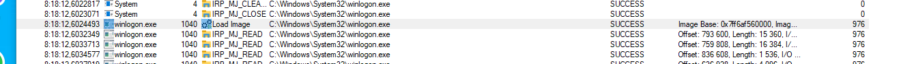

# Домашнее задание к занятию «ОС Windows (часть 1)»

В качестве результата пришлите ответы на вопросы в личном кабинете студента на сайте [netology.ru](https://netology.ru).

### Результат

В качестве результата пришлите ответы на следующие вопросы:
1. Какой процесс отображается в логе первым? Какой у него PID?

`процесс System, PID=4`

2. Какой "драйвер" загружается первым? Что это за драйвер (ответьте своими словами)?

`драйвер программы PROCMON для запуска мониторинга загрузки`

3. Какой PID у родительского процесса для smss.exe (не у самого smss.exe, а у того, кто его создал)?

`процесс System, PID=4`

4. Какой процесс является родительским для процесса winlogon.exe? Где расположен файл winlogon.exe? 

`процесс smss, PID=976`


5. Какой процесс является родительским для процесса lsass.exe?

`процесс smss, PID=984`


6. Что будет если в таск менеджере (taskmgr.exe) завершить работу следующего процесса Windows Log-On Application:

```
Процесс winlogon.exe является критически важной частью операционной системы Windows и нельзя получить доступ к ОС без этого процесса.
Он выполняет множество важных задач, связанных с авторизацией в ОС Windows, также перехватывает нажатие комбинации клавиш Ctrl + Alt + Delete. 
Приложение также отслеживает активность клавиатуры и мыши, и отвечает за блокировку ПК и запуск хранителей экрана после периода бездействия.
Таким образом, winlogon.exe должен постоянно продолжать работу в фоновом режиме.
 
Могу ли я отключить его?
Нельзя продолжить работу в операционной системе Windows, отключив этот процесс. 
Если попытаться завершить процесс из Диспетчера задач, то возникнет сообщение о том, что завершение процесса «может привести к нестабильной работе системы». 
Если всё же «Завершить процесс», то экран станет черным, и ПК даже не ответит на «Ctrl + Alt + Delete».
ОС Windows всегда запускает этот процесс при включении ПК. Если это действие не удалось, то компьютер выдаст синий экран с кодом ошибки «0xC000021A», обычно именуемый как «Blue screen of Death» (BSoD) – «синий экран смерти».

```