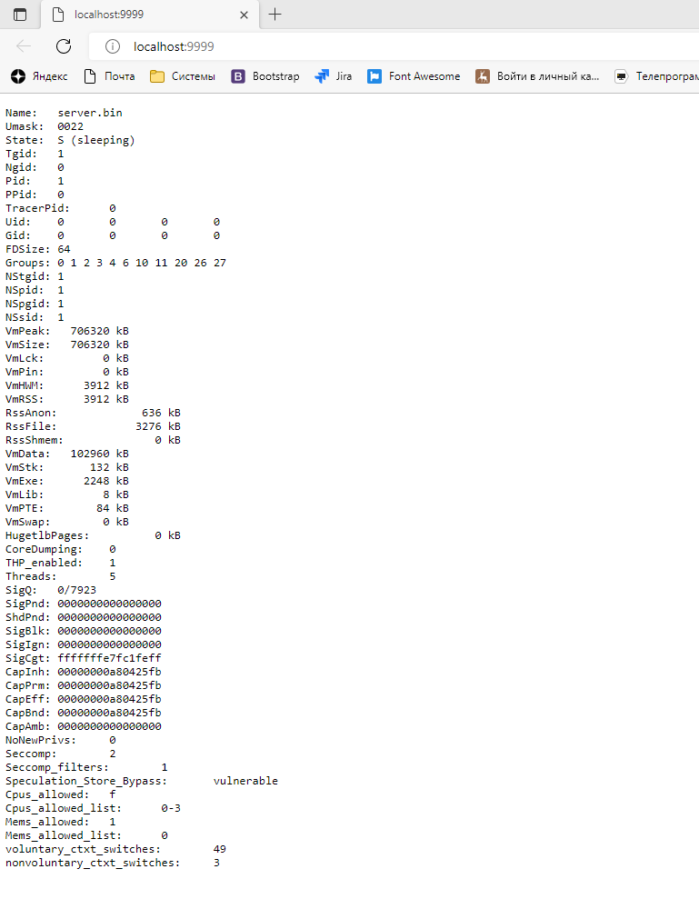

# Домашнее задание к занятию «1.1. Контейнеризация (Docker)»

В качестве результата отправьте ответы на вопросы в личном кабинете студента на сайте [netology.ru](https://netology.ru).

## Предисловие

ДЗ будет представлять собой лабораторные работы, в которых вы по инструкциям выполните определённые шаги.

Важно: перед выполнением ДЗ обязательно ознакомьтесь с инструкцией [по установке Docker](installation.md).

## Задание №1. Создание Docker Image

Задание описано [в отдельном документе](dockerfile.md).

В качестве результата работы отправьте:
1. Скриншот вывода команды `docker image ls`.

2. Скриншот вывода команды `docker container run ibdevapp`.

## Задание №2. Multistage Build

Задание описано [в отдельном документе](multistage.md).

В качестве результата работы отправьте:
1. Скриншот вывода команды `docker image ls`.

2. Скриншот вывода команды `docker-compose up --build`.

