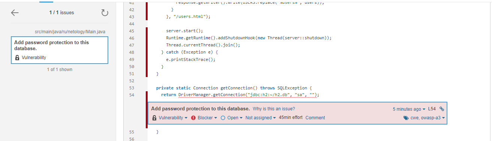
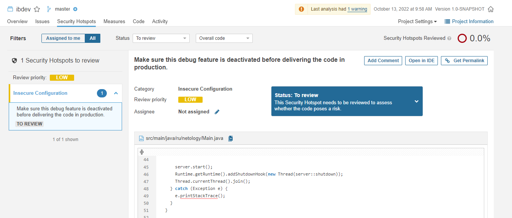

# Домашнее задание к занятию «1.2. Популярные языки, системы сборки, управления зависимостями»

В качестве результата отправьте ответы на вопросы в личном кабинете студента на сайте [netology.ru](https://netology.ru).

**Общие результаты сканирования**


Отправьте в личном кабинете студента ответы на следующие вопросы:
1. Какие баги были выявлены: количество, описание, почему SonarQube их считает багами? См. ссылку `Why is this an issue?`.

**Выявленные баги - 1 шт.**


**- Описание: объявлена новая переменная, вместо использования входящего параметра;**

3. Какие уязвимости были выявлены: количество, категории, описание, почему SonarQube их считает уязвимостями?

**Уязвимости - 1 шт.**



**- Описание: добавить использование пароля для подключения в базе данных;**

5. Какие Security Hotspots были выявлены: количество, категории, приоритет, описание, почему SonarQube их считает Security HotSpot'ами?

**Проблемы безопасности - 1 шт.**



**- Описание: добавить использование пароля для подключения в базе данных;**

7. К каким CWE идёт отсылка для Security Hotspots из п. 2? См. вкладку `How can you fix it?` в нижней части страницы.

```yaml
See
OWASP Top 10 2017 Category A3 - Sensitive Data Exposure
MITRE, CWE-489 - Leftover Debug Code
MITRE, CWE-215 - Information Exposure Through Debug Information
```

9. Какие запахи кода были выявлены: количество, описание, почему SonarQube их считает запахами кода? См. ссылку `Why is this an issue?`.

**Запахи кода - 5 шт.**


```
- Unnecessary imports should be removed (удалить необязательные импорты библиотек)
- Standard outputs should not be used directly to log anything (стандартный вывод не должен использоваться для логирования)
- Boolean expressions should not be gratuitous (Логические выражения не должны использоваться напрямую сразу после присвоения значения)
- Generic exceptions should never be thrown (Общие исключения никогда не должны создаваться)
```