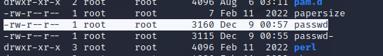
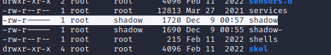

# Домашнее задание к занятию «Linux Hardening»

В качестве результата пришлите ответы на вопросы в личном кабинете студента на сайте [netology.ru](https://netology.ru/).

## 

### Задание 1

- Создайте пользователя `student1` с оболочкой bash, входящего в группу `student1`.

```text
sudo useradd student1 -g student1
```


- Создайте пользователя `student2`, входящего в группу `student2`.

```text
sudo useradd student2 -g student2
```


*Дайте ответ в виде снимков экрана.*

------

### Задание 2

- Создайте в общем каталоге, например, /tmp, директорию.
- Назначьте для неё полный доступ со стороны группы `student2` и доступ на чтение всем остальным.

```text
sudo chgrp student2 tmp
chmod g+rwx tmp
chmod o+r tmp
```


*Дайте ответ в виде снимков экрана.*

------

### Задание 3

- Определите, какой режим доступа установлен для файлов `/etc/passwd` и `/etc/shadow`.


```text
- чтение и завись для владельца суперпользователя root;
- для остальных только чтение.
```


```text
- чтение и завись для владельца суперпользователя root;
- для группы shadow только чтение;
- для остальных доступ запрещен.
```

- Объясните, зачем понадобилось именно два файла. 

```text
Для ограничения доступа к паролям, он недоступен для чтения никому кроме суперпользователя.
Также содержит дополнительную информацию по паролям.
```

Содержание файлов:

```text
/etc/passwd — файл, содержащий в текстовом формате список пользовательских учётных записей (аккаунтов).
Является основным источником информации о правах пользователя операционной системы. 
Содержит следующую информацию:
- первое поле отвечает за имя пользователя (drobbins);
- второе поле содержит «x». На устаревших Linux-системах второе поле содержало зашифрованных пароль для аутентификации.
- третье поле отвечает за числовой пользовательский идентификатор, связанный с конкретным пользователем.
- четвертое поле ассоциирует этого пользователя с конкретной группой; 
- пятое поле содержит текстовое описание аккаунта, в нашем случае это имя пользователя.
- шестое поле определяет домашний каталог пользователя.
- седьмое — устанавливает стартовую оболочку пользователя, которая будет автоматически запускаться когда пользователь входит в систему.

/etc/shadow доступен для чтения только суперпользователю и содержит зашифрованную информацию о паролях. 
Каждая строка определяет информацию о пароле конкретного аккаунта, поля в ней разделены знаком ":".
- первое поле определяет конкретный пользовательский аккаунт, которому соответствует данная «теневая» запись. 
- во втором поле содержится зашифрованный пароль. Оставшиеся поля описаны в таблице ниже:
- третье поле — количество дней с 01.01.1970 до момента, когда пароль был изменен
- четвертое поле — количество дней до того, как будет разрешено сменить пароль («0» — «менять в любое время»)
- пятое поле — количество дней до того, как система заставит пользователя сменить пароль ("-1" — «никогда»)
- шестое поле — количество дней до истечения срока действия пароля, когда пользователь получит предупреждение об этом ("-1" — «не предупреждать»)
- седьмое поле — количество дней после истечения срока действия пароля, по прошествии которых аккаунт будет автоматически отключен системой ("-1" — «не отключать»)
- восьмое поле — количество дней, прошедшее с момента отключения этого аккаунта ("-1" — «этот аккаунт включен»)
- девятое поле — зарезервировано для будущего использования
```

*Дайте ответ в виде снимков экрана.*

------
