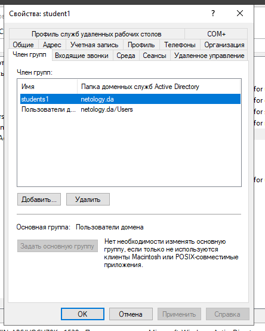
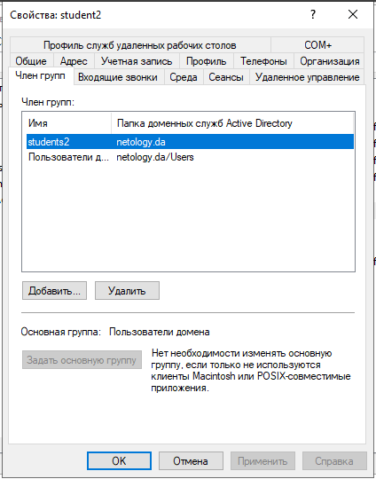
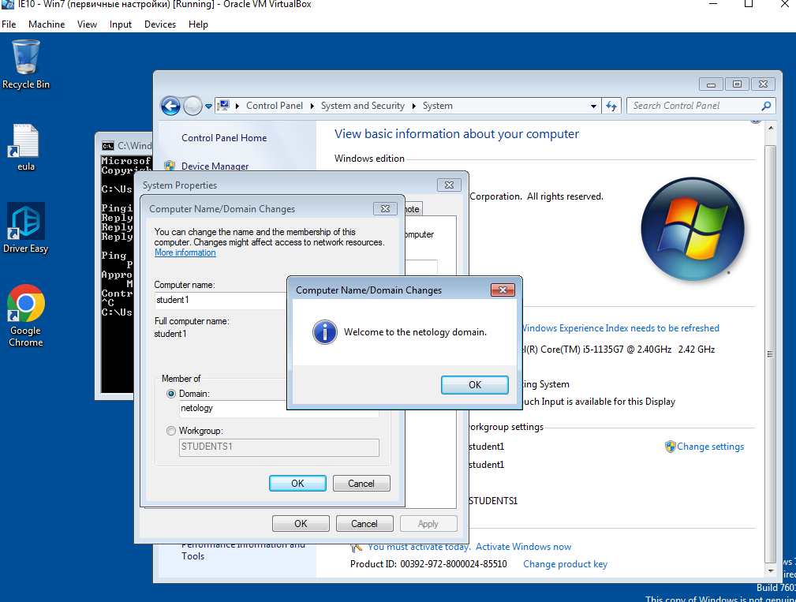

# Домашнее задание к занятию «Active Directory. Часть 1»

В качестве результата пришлите ответы на вопросы в личном кабинете студента на сайте [netology.ru](https://netology.ru/).

## 

### Задание 1

1. Скачайте и установите Windows Server 2019 (2016), используя файл по [ссылке](https://www.microsoft.com/en-us/evalcenter/evaluate-windows-server-2019). 

Настройки виртуальной машины:
- два сетевых интерфейса: NAT и внутренняя сеть;
- оперативная память — 2–4 Гб.

2. Настройте Active Directory, используя материалы из открытых источников ниже:

- [материал 1](https://1cloud.ru/help/windows/active-directory-domain-services-ustanovka-i-nastrojka-windows-server);
- [материал 2](https://habr.com/ru/company/testo_lang/blog/525326/);
- [материал 3](https://efsol.ru/manuals/active-directory.html).

*Дайте ответ в виде снимков экрана.*

ОТВЕТ:

------

### Задание 2

Создайте в AD:

- пользователя `student1`, входящего в группу `students1`;
- пользователя `student2`, входящего в группу `students2`.

*Дайте ответ в виде снимков экрана.*

ОТВЕТ:

------

### Задание 3

- Создайте или используйте существующую ВМ с установленной ОС Windows и подключите к домену [ссылке](https://docs.microsoft.com/ru-ru/windows-server/identity/ad-fs/deployment/join-a-computer-to-a-domain);
- Зайдите под доменными учётными записями.

*Дайте ответ в виде снимков экрана.*

ОТВЕТ:

------