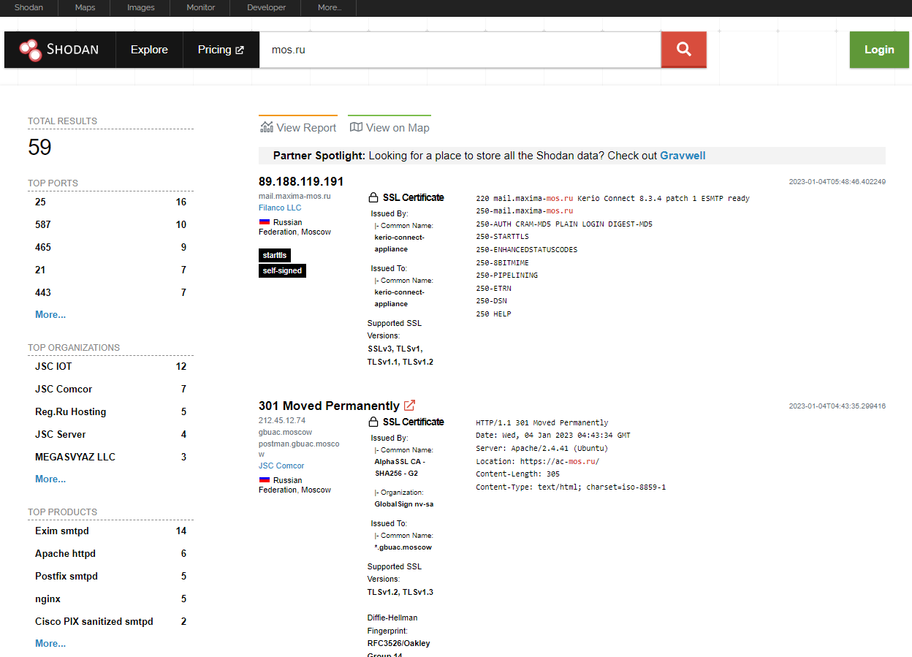
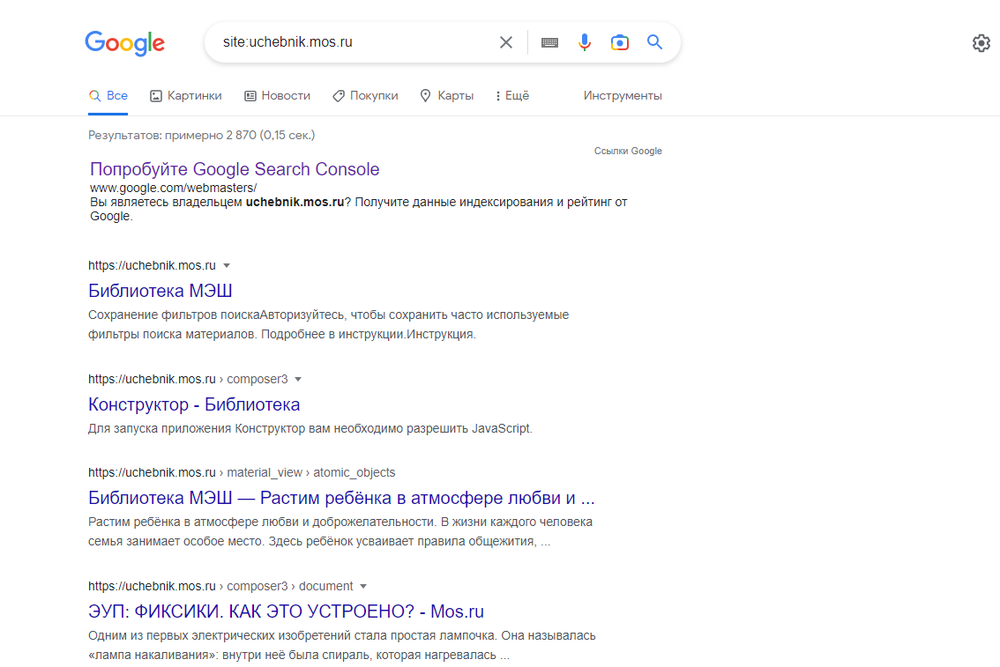
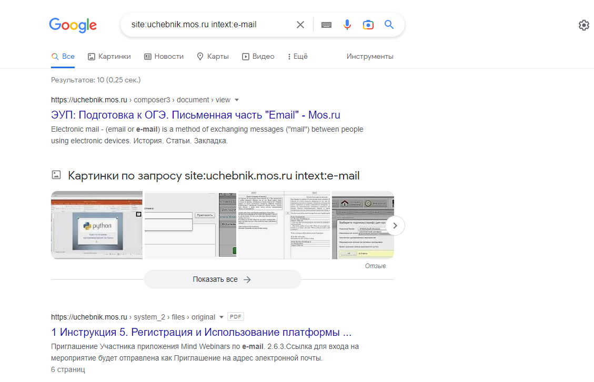

# Домашнее задание к занятию «Penetration Testing. Часть 1»

В качестве результата пришлите ответы на вопросы в личном кабинете студента на сайте [netology.ru](https://netology.ru/).

### Задание 1

Используйте инструменты OSINT и найдите информацию о любом сервисе, которым пользуйтесь каждый день. 

Рекомендуем искать: 
- расположение дата-центров;
- почтовые сервера;
- чаты;
- файлы в открытом доступе;
- адреса офисов;
- ресурсы, где можно найти сотрудников компании и т. д.

Напишите отчёт о найденной информации, которая могла бы быть использована для пентеста.

## ОТЧЕТ О ПРОДЕЛАННОЙ РАБОТЕ

### будем проверять сайт - uchebnik.mos.ru

### 1 Доменные имена
Самое первое и простое что мы можем сделать — это порезолвить доменные имена. Для этого есть десятки утилит, как терминальных так и доступных онлайн.

```text
nslookup uchebnik.mos.ru
Server:         10.4.4.8
Address:        10.4.4.8#53

Non-authoritative answer:
Name:   uchebnik.mos.ru
Address: 212.11.155.243
```

```text
dig @8.8.8.8 uchebnik.mos.ru ANY

; <<>> DiG 9.18.0-2-Debian <<>> @8.8.8.8 uchebnik.mos.ru ANY
; (1 server found)
;; global options: +cmd
;; Got answer:
;; ->>HEADER<<- opcode: QUERY, status: NOERROR, id: 488
;; flags: qr rd ra; QUERY: 1, ANSWER: 3, AUTHORITY: 0, ADDITIONAL: 1

;; OPT PSEUDOSECTION:
; EDNS: version: 0, flags:; udp: 512
;; QUESTION SECTION:
;uchebnik.mos.ru.               IN      ANY

;; ANSWER SECTION:
uchebnik.mos.ru.        300     IN      A       212.11.155.243
uchebnik.mos.ru.        300     IN      A       212.11.155.242
uchebnik.mos.ru.        300     IN      A       212.11.155.244

;; Query time: 1055 msec
;; SERVER: 8.8.8.8#53(8.8.8.8) (TCP)
;; WHEN: Tue Jan 03 04:58:10 EST 2023
;; MSG SIZE  rcvd: 92
```

Что это нам дает?

Помимо соответствия IP-адрес—домен мы можем узнать, например, DNS-серверы, с помощью утилиты nslookup, а также можем получить все DNS-записи, например, командой dig.

### 2. Whois
Whois — протокол, основная цель которого заключается в получении регистрационных данных о владельцах доменных имён, IP-адресах и автономных систем (ASN).

```text
whois uchebnik.mos.ru
whois 212.11.155.243

whois 212.11.155.243
% This is the RIPE Database query service.
% The objects are in RPSL format.
%
% The RIPE Database is subject to Terms and Conditions.
% See http://www.ripe.net/db/support/db-terms-conditions.pdf

% Note: this output has been filtered.
%       To receive output for a database update, use the "-B" flag.

% Information related to '212.11.154.0 - 212.11.157.255'

% Abuse contact for '212.11.154.0 - 212.11.157.255' is 'noc@mos.ru'

inetnum:        212.11.154.0 - 212.11.157.255
netname:        MOSOIV
org:            ORG-MMO1-RIPE
country:        RU
admin-c:        MAV211-RIPE
tech-c:         SKV45-RIPE
status:         ASSIGNED PA
mnt-by:         AS8901-MNT
created:        2016-10-12T11:12:00Z
last-modified:  2022-02-26T17:50:12Z
source:         RIPE # Filtered

organisation:   ORG-MMO1-RIPE
org-name:       GKU "Mosgortelecom"
country:        RU
org-type:       LIR
address:        2A, 1st Borodinskaya str.
address:        121059
address:        Moscow
address:        RUSSIAN FEDERATION
phone:          +7 495 537-77-77
admin-c:        SKV45-RIPE
abuse-c:        AC28576-RIPE
mnt-ref:        RIPE-NCC-HM-MNT
mnt-ref:        AS8901-MNT
mnt-by:         RIPE-NCC-HM-MNT
mnt-by:         AS8901-MNT
created:        2004-04-17T11:55:22Z
last-modified:  2022-02-26T17:37:21Z
source:         RIPE # Filtered

person:         Aleksandr M
address:        Moscow, Russia
phone:          +7 495
mnt-by:         AS8901-MNT
nic-hdl:        MAV211-RIPE
created:        2016-10-12T10:22:42Z
last-modified:  2022-02-26T17:40:08Z
source:         RIPE

person:         Kirill S.
address:        Moscow, Russia
phone:          +7 495
nic-hdl:        SKV45-RIPE
mnt-by:         AS8901-MNT
created:        2018-01-18T08:48:05Z
last-modified:  2022-02-26T17:36:01Z
source:         RIPE

% Information related to '212.11.154.0/23AS8901'

route:          212.11.154.0/23
origin:         AS8901
mnt-by:         AS8901-MNT
created:        2019-04-11T20:34:54Z
last-modified:  2019-04-11T20:35:30Z
source:         RIPE
descr:          COD-KR-2

% This query was served by the RIPE Database Query Service version 1.105 (BUSA)
```

Что это нам дает?

Из вывода Whois можно получить email-адреса владельцев и администраторов, адреса DNS-серевров, подсети и ASN.

### 3.IP и подсети

Reverse DNS lookup
Обратный резолв DNS-адресов — поиск по PTR записям DNS. Если администратор добавил такую запись, то по IP-адресу можно будет узнать, какие доменные адреса на него указывают.

`https://check-host.net/check-dns?host=uchebnik.mos.ru&csrf_token=416cc222e96b83fc7a233f0dd73dffa3fa8a72d7`


### 4.SSL\TLS сертификаты
Получение новых поддоменов из сертификатов

```text
certgraph -json uchebnik.mos.ru
{
        "certgraph": {
                "command": "certgraph -json uchebnik.mos.ru",
                "options": {
                        "cdn": false,
                        "ct_expired": false,
                        "ct_subdomains": false,
                        "driver": "http",
                        "parallel": 10,
                        "sanscap": 80,
                        "timeout": 10000000000
                },
                "scan_date": "2023-01-03T10:31:32.761213692Z",
                "version": "Git commit: none [master]",
                "website": "https://lanrat.github.io/certgraph/"
        },
        "depth": 2,
        "links": [
                {
                        "source": "uchebnik.mos.ru",
                        "target": "41FCAE7BE450A17862F1094DF3F1D5EFAB5BFB99D854D7F320FAAA148F02DB6D",
                        "type": "http"
                },
                {
                        "source": "mos.ru",
                        "target": "41FCAE7BE450A17862F1094DF3F1D5EFAB5BFB99D854D7F320FAAA148F02DB6D",
                        "type": "http"
                },
                {
                        "source": "www.mos.ru",
                        "target": "41FCAE7BE450A17862F1094DF3F1D5EFAB5BFB99D854D7F320FAAA148F02DB6D",
                        "type": "http"
                },
                {
                        "source": "41FCAE7BE450A17862F1094DF3F1D5EFAB5BFB99D854D7F320FAAA148F02DB6D",
                        "target": "mos.ru",
                        "type": "sans"
                },
                {
                        "source": "41FCAE7BE450A17862F1094DF3F1D5EFAB5BFB99D854D7F320FAAA148F02DB6D",
                        "target": "mos.ru",
                        "type": "sans"
                }
        ],
        "nodes": [
                {
                        "depth": "0",
                        "hasDNS": "false",
                        "id": "uchebnik.mos.ru",
                        "related": "",
                        "root": "true",
                        "status": "Good",
                        "type": "domain"
                },
                {
                        "depth": "1",
                        "hasDNS": "false",
                        "id": "mos.ru",
                        "related": "www.mos.ru",
                        "root": "false",
                        "status": "Redirect(www.mos.ru)",
                        "type": "domain"
                },
                {
                        "depth": "2",
                        "hasDNS": "false",
                        "id": "www.mos.ru",
                        "related": "",
                        "root": "false",
                        "status": "Good",
                        "type": "domain"
                },
                {
                        "found": "http",
                        "id": "41FCAE7BE450A17862F1094DF3F1D5EFAB5BFB99D854D7F320FAAA148F02DB6D",
                        "type": "certificate"
                }
        ],
        "numDomains": 3
}
```
Что это нам дает?

Новые поддомены
Уязвимости криптографии
Версия используемого ПО на сервере

### 5. Поиск email-адресов


### 6. Поисковые системы для хакеров

```text
https://www.binaryedge.io/

https://app.binaryedge.io/services/query?query=ip:%22212.11.152.0%2F21%22%20country:%22RU%22&page=1
```


### 7. theHarvester в Kali Linux

theHarvester -d mos.ru -l 500 -b google

```text

*******************************************************************
*  _   _                                            _             *                                                                   
* | |_| |__   ___    /\  /\__ _ _ ____   _____  ___| |_ ___ _ __  *                                                                   
* | __|  _ \ / _ \  / /_/ / _` | '__\ \ / / _ \/ __| __/ _ \ '__| *                                                                   
* | |_| | | |  __/ / __  / (_| | |   \ V /  __/\__ \ ||  __/ |    *                                                                   
*  \__|_| |_|\___| \/ /_/ \__,_|_|    \_/ \___||___/\__\___|_|    *                                                                   
*                                                                 *                                                                   
* theHarvester 4.0.3                                              *                                                                   
* Coded by Christian Martorella                                   *                                                                   
* Edge-Security Research                                          *                                                                   
* cmartorella@edge-security.com                                   *                                                                   
*                                                                 *                                                                   
*******************************************************************                                                                   
                                                                                                                                      
                                                                                                                                      
[*] Target: mos.ru 
                                                                                                                                      
        Searching 0 results.
        Searching 100 results.
        Searching 200 results.
Google is blocking your ip and the workaround, returning
        Searching 300 results.
Google is blocking your ip and the workaround, returning
        Searching 400 results.
Google is blocking your ip and the workaround, returning
        Searching 500 results.
[*] Searching Google. 

[*] No IPs found.

[*] Emails found: 5
----------------------
mcko@edu.mos.ru
portal_support@gaui.mos.ru
subbota@edu.mos.ru
x22@md.mos.ru
x22portal_support@gaui.mos.ru

[*] Hosts found: 21
---------------------
2030.mos.ru:62.109.9.232
ag.mos.ru:212.11.155.166, 212.11.155.165, 212.11.155.167
api.economy.mos.ru:146.185.209.140
data.mos.ru:212.11.151.170
economy.mos.ru:146.185.209.140
edu.mos.ru
gaui.mos.ru
gorod.mos.ru:212.11.155.167, 212.11.155.165, 212.11.155.166
housing.mos.ru:212.11.151.23
isogd.mos.ru:185.173.2.33
md.mos.ru:212.11.155.165, 212.11.155.166, 212.11.155.167
parking.mos.ru:178.248.238.59
pgu.mos.ru:212.11.155.165, 212.11.155.167, 212.11.155.166
sao.mos.ru:212.11.155.165, 212.11.155.166, 212.11.155.167
transport.mos.ru:82.202.190.153
www.mos.ru:94.79.51.14
www.pgu.mos.ru:212.45.30.108, 37.230.149.156
x22economy.mos.ru
x22gorod.mos.ru
x22parking.mos.ru
x22www.mos.ru
```


### 8.shodan



### 9.google

```text
uchebnik.mos.ru

https://www.google.ru/search?q=site%3Auchebnik.mos.ru+intext%3Ae-mail&newwindow=1&sxsrf=ALiCzsYM6BN8-h1R8GAC7EYDcsm8xtPrpg%3A1672814960109&ei=cCG1Y9WvBobwrgTDw7FY&ved=0ahUKEwjVp-Orqa38AhUGuIsKHcNhDAsQ4dUDCA8&uact=5&oq=site%3Auchebnik.mos.ru+intext%3Ae-mail&gs_lcp=Cgxnd3Mtd2l6LXNlcnAQA0oECEEYAUoECEYYAFAAWABg2R1oAXAAeACAAQCIAQCSAQCYAQCgAQLAAQE&sclient=gws-wiz-serp

https://www.google.ru/search?q=site%3Auchebnik.mos.ru&newwindow=1&sxsrf=ALiCzsYM6BN8-h1R8GAC7EYDcsm8xtPrpg%3A1672814960109&ei=cCG1Y9WvBobwrgTDw7FY&ved=0ahUKEwjVp-Orqa38AhUGuIsKHcNhDAsQ4dUDCA8&uact=5&oq=site%3Auchebnik.mos.ru&gs_lcp=Cgxnd3Mtd2l6LXNlcnAQA0oECEEYAUoECEYYAFC-Blj7B2C1C2gBcAB4AIABQYgBgAGSAQEymAEAoAEBwAEB&sclient=gws-wiz-serp

```






### 10. расположение


------

### Задание 2

- Проведите первичный пентест уязвимого приложения Google Gruyere с помощью OWASP ZAP или Burp Suite. 
- Найдите в приложениях XSS, XSRF, XSSI, Path Tracersal и Code Execution. Какая-то часть уязвимостей может быть найдена автоматически, другая часть найдётся только вручную. 

Не рекомендуем пользоваться ответами, но можно посмотреть в подсказки.
[Google Gruyere](https://google-gruyere.appspot.com/).

Пришлите отчёт о том:
- каким образом вы смогли найти уязвимости;
- как можно эксплуатировать эти уязвимости приложений.

## ОТЧЕТ

Сканируем приложение: https://google-gruyere.appspot.com/561343933704307424955848114688252962122/

### 1. Найдите в приложениях XSS

Межсайтовый скриптинг (XSS) - это уязвимость, которая позволяет злоумышленнику внедрять код (обычно HTML или JavaScript) в содержимое веб-сайта, находящегося вне контроля злоумышленника. Когда жертва просматривает такую страницу, введенный код выполняется в браузере жертвы. Таким образом, злоумышленник обошел политику того же источника браузера и может украсть личную информацию жертвы, связанную с рассматриваемым веб-сайтом.

#### 1-1) Уязвимость через адресную строку:
https://google-gruyere.appspot.com/380075102534537954520940078031300502308/snippets.gtl?uid=+%3Cscript%3Ealert('Finded XSS')%3C/script%3E


#### 1-2) File Upload XSS
Создаем файл xss.html с содержимым
```text
<script>
alert(document.cookie);
</script>
```

Загружаем его и получаем адрес его размещения
https://google-gruyere.appspot.com/380075102534537954520940078031300502308/alex/xss.html
Переходим на адрес и видим куки приложения


#### 1-3) Reflected XSS


#### 1-4) Stored XSS
создать файл с содержимым
```text
<p <script>alert(1)</script>hello
```
загружаем его
https://google-gruyere.appspot.com/380075102534537954520940078031300502308/alex/stored xss.html
запускаем ссылку


### 2. XSRF

Когда браузер отправляет запросы на сайт, он всегда отправляет все файлы cookie, которые у него есть для этого сайта, независимо от того, откуда поступает запрос. 
Кроме того, веб-серверы обычно не могут отличить запрос, инициированный преднамеренным действием пользователя (например, пользователь нажимает на кнопку "Отправить"), 
от запроса, выполненного браузером без действия пользователя (например, запрос на встроенное изображение на странице). 
Поэтому, если сайт получает запрос на выполнение какого—либо действия (например, удаление почты, изменение контактного адреса), он не может знать, 
было ли это действие сознательно инициировано пользователем - даже если запрос содержит файлы cookie для аутентификации. 
Злоумышленник может использовать этот факт, чтобы обмануть сервер и заставить его выполнять действия, которые пользователь не намеревался выполнять.

создаем файл XSRF с содержимым

```text
<h1>Alex page</h1>
<p>Useful information</p>

```

Загружаем этот файл от Алекса получаем на него ссылку
https://google-gruyere.appspot.com/380075102534537954520940078031300502308/alex/xsrf.html


Эту ссылку добавляем в профиль алекса в домашнюю страницу


создаем бобу статьи 


под бобом открываем домашнюю страничку алекса


смотрим дом страницу алекса


### Потом обнаруживаем под бобом что пропала его статья


### 3. XSSI

```text
Браузеры не позволяют страницам одного домена читать страницы в других доменах. Но они не мешают страницам домена ссылаться на ресурсы в других доменах. В частности, они позволяют отображать изображения из других доменов и выполнять скрипты из других доменов. Включенный скрипт не имеет своего собственного контекста безопасности. Он запускается в контексте безопасности страницы, которая его включила. Например, если www.evil.example.com включает в себя скрипт, размещенный на www.google.com затем этот скрипт запускается в контексте evil, а не в контексте Google. Таким образом, любые пользовательские данные в этом скрипте будут "утекать".

Выполняется путем внедрения на сторонний сайт скрипта запускающего скрипты данного сайта
<script>
function _feed(s) {
  alert("Your private snippet is: " + s['private_snippet']);
}
</script>
<script src="https://google-gruyere.appspot.com/561343933704307424955848114688252962122/feed.gtl"></script>
```

#### 3-1-Создаем двух пользователей alex и bob

#### 3-2-Создаем private snippet alex 


#### 3-3-Создаем private snippet  bob


#### 3-4-Создаем файл с содержимым 

```html
<h1>Bob page</h1>
<p>Useful information</p>
<script>
function _feed(s) {
  alert("Your private snippet is: " + s['private_snippet']);
}
</script>
<script src="https://google-gruyere.appspot.com/380075102534537954520940078031300502308/feed.gtl"></script>
```


#### 3-5-Загружаем его как домашнюю страницу боба


#### 3-6 Под alex открываем дом страницу bob и видим его частный комментарий.


### 4. Path Traversal

Большинство веб-приложений обслуживают статические ресурсы, такие как изображения и CSS-файлы. Часто приложения просто обслуживают все файлы в папке. Если приложение не будет осторожным, пользователь может использовать атаку обхода пути для чтения файлов из других папок, к которым у него не должно быть доступа. Например, как в Windows, так и в Linux .. представляет родительский каталог, поэтому, если вы можете ввести ../ в путь, вы можете "сбежать" в родительский каталог.

#### 4-1 Cоздать пользователя с именем ..


#### 4-2 Загрузить файл от имени этого пользователя secret.txt


https://google-gruyere.appspot.com/380075102534537954520940078031300502308/../secret.txt

#### 4-3 Получить файл по пути

https://google-gruyere.appspot.com/380075102534537954520940078031300502308%2f..%2fsecret.txt


### 5. Code Execution

#### 5-1 Cоздать пользователя с именем ..


#### 5-2 Загрузить файл от имени этого пользователя gtl.py


#### 5-3 Содержимое gtl.py на сервере поменялось

До загрузки:


После загрузки:


#### 5-4 И сервер больше не стартует


#### Потому что изломали скрипт

------


